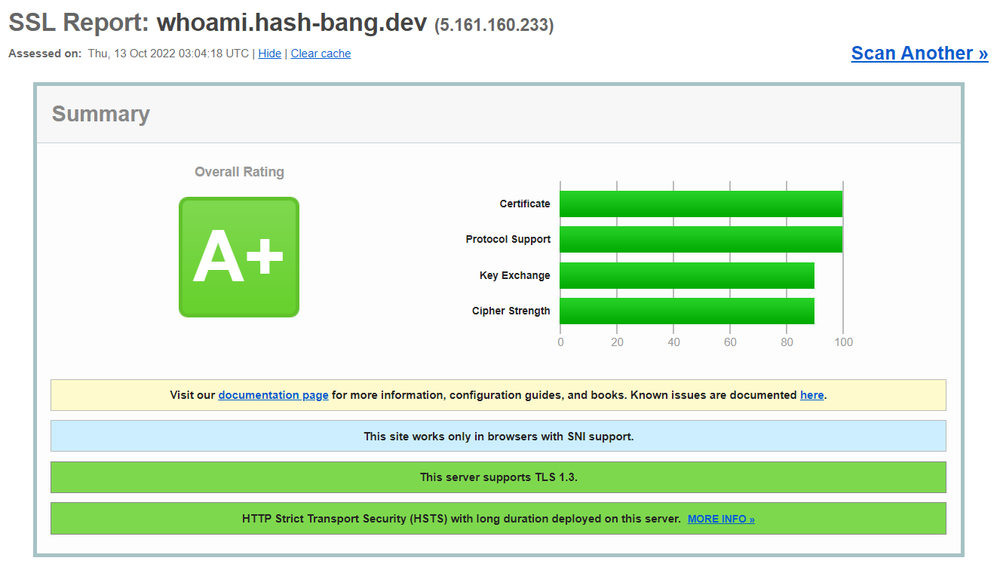

## Chapter #2 - whoami

Install a kute [whoami](https://hub.docker.com/r/traefik/traefikee-webapp-demo) webserver from
Traefik dockerhub. This server may be configured to produce an ASCII message for the console.  
  
This example installation goes step by step from issuing a letsencrypt staging certificate up
to deploying the websecure application using Traefik CRD provider with production certificates
and a set of middlewares for HTTP redirection, SSL strong security and 'www' prefix stripping.  

---

### #0. Pre Requisites
You need to have deployed `ClusterIssuers` for staging and production certificates.
See [Chapter #1 - Create Cluster Issuers](../01-cluster-issuer/README.md).  

---

### #1. Create the namespace for your application and switch to it.

All examples are defined for my develoment environment, the `hash-bang.dev` domain.  
Be carefull to replace the `hash-bang` namespace and `whoami.hash-bang.dev` urls with your own
namespace and domain in commands and YAML files.  

Create the application namespace and set it as current in kubectl:

```
kubectl create namespace hash-bang
kubectl config set-context --current --namespace hash-bang
```

---

### #2. Deploy whoami application

Create the application `Deployment` and it's `Service` (remember to replace `hash-bang`
definitions in all files).  

You can also customize the name printed on console responses. It is currently printing `#!.dev`.  
Try [https://whoami.hash-bang.dev](https://whoami.hash-bang.dev) and see it yourself!  

Deploy pods and service:

```
kubectl apply -f 01-deployment.yaml
```

---

### #3. Create a staging certificate

Staging certificates are appropriate for the experimentation, necessary to validate
your set up. It is easy to get blocked on LetsEncrypt with repeated requests for
production certificates.  

We are requesting a certificate for two DNS entries:
- hash-bang.dev
- www.hash-bang.dev

Edit the 02-certificate-staging.yaml file to set your `namespace` and `domain name`.  
Then apply the certificate request:

```
kubectl apply -f 02-certificate-staging.yaml
```

You can check the process of the certificate is being issued with:
```
kubectl get cert

NAME                          READY   SECRET                        AGE
whoami-hashbang-dev-staging   True    whoami-hashbang-dev-staging   1m 
```

If your certificate does not get issued you can try to find the problem with:

```
kubectl get clusterissuers
kubectl describe clusterissuers letsencrypt-staging

kubectl get certificaterequests 
kubectl describe certificaterequests whoami-hashbang-dev-staging-abcd

kubectl get orders
kubectl describet orders whoami-hashbang-dev-staging-abcd-12345678

kubectl get challenges
kubectl describe challenges <challenge-name>

kubectl get cert
kubectl describe cert whoami-hashbang-dev-staging
```

---

### #4. Apply an IngressRoute using the certificate secret
Once your certificate is issued it is also stored in a secret at your namespace.
```
kubectl get secret

NAME                          TYPE                DATA   AGE
whoami-hashbang-dev-staging   kubernetes.io/tls   2      8m
```

Edit the `IngressRoute` yaml file, setting your `namespace` and `secret name`.  
Apply it with kubectl:
```
kubectl apply -f 03-ingressroute-staging.yaml
```

Now you can check services and routes on traefik dashboard.  

> It may be necessary to port-forward the traefik internal port first, my k3s
> kubernetes have traefik in the `kube-system namespace`, then use:
> ```
> kubectl -n kube-system port-forward $(kubectl get -n kube-system pods --selector "app.kubernetes.io/name=traefik" --output=name) 9000:9000
> ```
> Now  there will be a private tunnel from localhost:9000 to traefik-pod:9000  


Open the dashboard on [localhost:9000/dashboard/](http://localhost:9000/dashboard/).  
Inside the dashboard check routers and services to see that everything is properlly
configured.  

We configured only a websecure route and it should be using a SSH certificate signed with
letsencrypt-staging. Staging certificates are considered invalid and you need to use curl
**-k** to allow the connection.  

With the **-v** flag prints all connection info and you will be able to check the
certificate issuer, should be letsencrypt-staging. If traefik does not find your secret
(misspelled or in a wrong namespace) you will get a traefik issued certificate instead.

```
curl https://domain.name -kv
```

---

### #5. After success with LetsEncrypt **staging** lets request a **production** certificate.  

Request a production certificate:
```
kubectl apply -f 04-certificate.yaml
```

Verify the certificate has been generated and stored in a new secret:
```
kubectl get cert
NAME                          READY   SECRET                        AGE
whoami-hashbang-dev           True    whoami-hashbang-dev           2m
whoami-hashbang-dev-staging   True    whoami-hashbang-dev-staging   23m
```
```
kubectl get secret
NAME                          TYPE                DATA   AGE
whoami-hashbang-dev           kubernetes.io/tls   2      2m
whoami-hashbang-dev-staging   kubernetes.io/tls   2      23m
```

---

### #6. Setup middleware and tlsoptions

We are going to do a litte bit more for the production setup by defining three middlewares to:
- Strip www prefix in HTTP and HTTPS routes (always redirecting to HTTPS).
- Redirect from HTTP scheme to HTTPS.
- Add security headers on the HTTPS response.
- Configure strong SSL encryption.

Observe that these security headers may include HSTS headers, but they are currently
commented out in the example yaml. Visit [HSTS Preload](https://hstspreload.org) to know
more about this project. Some important considerations mentioned there:
- HTST requires redirect from HTTP to HTTPS.
- HSTS may enforce sub-domains strict HTTPS access.
- It is easy to join the program but it may take a long time to get out of it.

Apply after you decide about HSTS and have edited `namespaces` in the yaml:
```
kubectl apply -f 05-middleware.yaml
```

Edit `namespace` and create `TLSOptions` that will ensure min TLSv1.2 and define strong
SSH encryption:
```
kubectl apply -f 06-tlsoptions.yaml
```

### #7. Finally we replace the previous staging `IngressRoute` with a production one.

We now define two `IngressRoutes`:
- One for HTTP - with www stripping and redirection to HTTPS. 
- One for HTTPS - with www stripping and strong, security headers and strong encryption.
```
kubectl apply -f 07-ingressroute.yaml
```

It is all set now!
  - Check route configurations with middlewares through the Traefik [dashboard](http://localhost:9000/dashboard/).  
  - Retrieve response with curl, verifying the use of a production LetsEncrypt certificate and the use of extra security response headers.
  - Check www stripping and http redirection.

```
curl https://yourdomain.name -kv
```

And see the output without without **-k** and **-v**
```
curl https://yourdomain.name
```

Now verify redirection to HTTPS, first see the redirect response:
```
curl whoami.hash-bang.dev
```

And now following the redirection to HTTPS:
```
curl whoami.hash-bang.dev -L
```

You can also see www stripping (through permanent redirection):
```
curl https://www.whoami.hash-bang.dev
```

Following redirection:
```
curl https://www.whoami.hash-bang.dev -L
```

And at last, www stripping together with HTTP to HTTPS redirection.  
It is possible to verify that there is a single redirection stripping and setting HTTPS:
```
curl www.whoami.hash-bang.dev -Lv
```

### #8. See that we receive A+ evaluation for TLS security

This site now will be evaluated as A+ in SSL Labs test [SSL Labs](https://www.ssllabs.com/ssltest/analyze.html).


